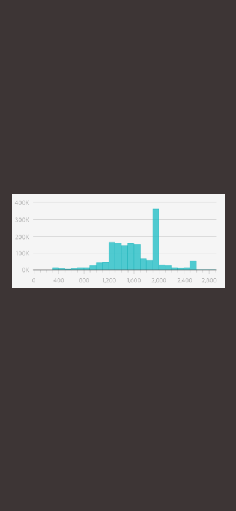
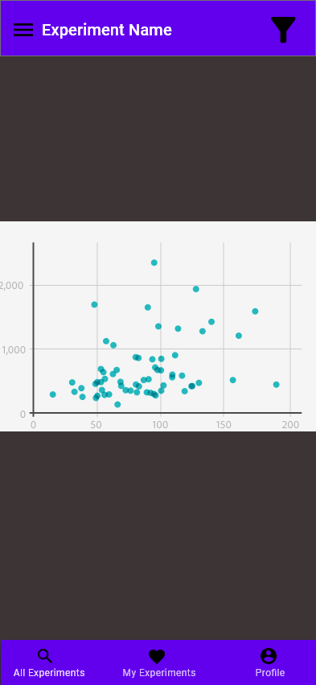
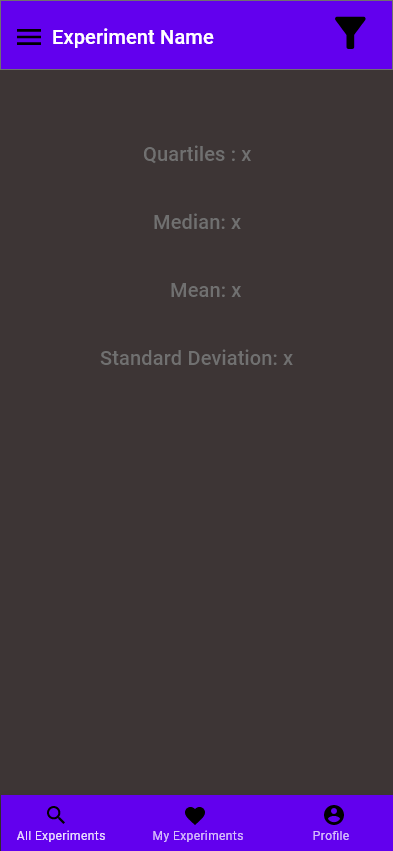
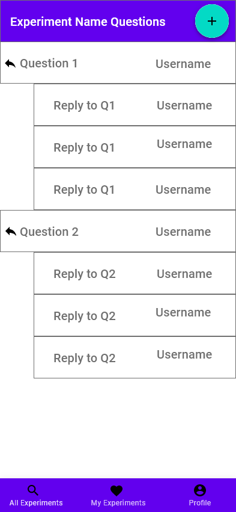

## US 01.01.01
* By pressing the "+" button at top right, the "Add Question" fragment will appear with the fields to create an experiment.  

## US 01.02.01
* Owners are about to select "Delete Experiment" from the menu to unpublish the experiment.  

  

## US 01.03.01
* Owners are about to select "End Experiment" from the menu to finish the experiment.  

  

## US 01.04.01
* In the "All Experiments" page, users can select the "+" button on the experiment to subscribe to the experiment. These subscribed experiments will appear in the "My Experiments" page.  

## US 01.05.01
* Once an experiment is selected from the "My Experiments" list, users are able to add trials to the experiment.  

## US 01.06.01
* By selecting "See Histogram" a histogram will appear.  

## US 01.07.01
* By selecting "See Plot" a plot will appear.  

## US 01.08.01
* While viwing stats about an experiment, the user can press the filter button to be able to de-select users results.  

## US 01.09.01
* By selecting "See Statistics" a page with stats will appear.  

## US 02.01.01
* Users can select an experiment from the "All Experiments" tab and the comment section will appear (this is also accessible with the comment button in the experiment view itself.) Once there, users can view comments and replys. Questions can be added by pressing the "+" button at the top right  

## US 02.02.01
* Users can press the reply icon to make a reply to a question.  

## US 02.03.01
* Users can view all questions and replys.  

## US 03.01.01
* Users By selecting the QR code icon from the menu, users can choose to generate or scan a QR code.  

  

## US 03.02.01
* Camera to be added in app  

  

## US 03.03.01

* Count trial ommited as it must be an "increment one"  
* Camera scanning will proceed after these screen  

## US 04.01.01
* User profile to see their own data  

## US 04.02.01
* Users can select the pencil icon to edit their information  

## US 04.03.01
* Users can view other peoples profiles (cannot edit).  

## US 05.01.01
* In All Experiment and My Experiments, users can type in the Search box.  

## US 05.02.01
* Experiments will be shown based on the search results.  

## US 06.01.01
* While making an experiment, the owner can decide if a location is required or not  

## US 06.02.01
* If the user select "OKAY", their current location will be used as the location for the trial  

## US 06.03.01
* Users are warned that the current trial is using their location  

## US 06.04.01
* Users can select the Location Heatmap icon from the menu to see a heatmap of trials for the experiment  

